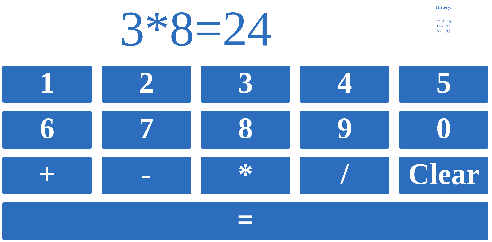

# Calculator

## Overview

Very simple calculator written in Javascript/JQuery. All code is in one file `index.html`. In real-world scenario, every part of code should be separated to files. CSS and Javascript should be in `*.css` and `*.js` files

## Preview

